<h1 align="center">⚔️ ai-battle</h1>

<p align="center">
  <strong>Structured roundtable discussions among multiple AI Agents</strong>
</p>

<p align="center">
  Auto-managed rounds · Consensus detection · Full session recording
</p>

<p align="center">
  <a href="https://www.npmjs.com/package/ai-battle"></a>
  
  
  <a href="LICENSE"></a>
</p>

<p align="center">
  <a href="#-中文文档">📖 中文文档</a>
</p>

---

## ✨ Features

| Feature | Description |
| :--- | :--- |
| 🤖 **Multi-Agent Roundtable** | Mix and match Claude / Codex / Gemini freely |
| 🔁 **Self-Debate** | Same agent can take multiple seats (e.g. `gemini,gemini`) |
| 🔨 **Referee Mode** | Independent referee summarizes each round, detects consensus, generates final report |
| 👁️ **God Mode** | Inject supplementary instructions after each round to steer the discussion |
| 💾 **Session Recording** | Saves raw Agent CLI output (stream-json / json / raw) |
| 🔄 **Resume Support** | Automatically resumes from the last round after interruption |
| 🔌 **Extensible** | Implement 3 functions + register to add a new agent |

## 🚀 Quick Start

```bash
# Create a discussion directory
mkdir my-topic && cd my-topic

# Define the topic
echo "Microservices vs Monolith: pros and cons?" > problem.md

# Start the discussion (auto-fetches latest version)
npx ai-battle --agents claude,gemini --rounds 8
```

## 📦 Installation

**Recommended: No install needed, use npx directly**

```bash
npx ai-battle --agents claude,gemini --rounds 5
```

> npx fetches the latest version automatically — no manual updates required.

**Global install:**

```bash
npm install -g ai-battle
```

### Prerequisites

- `bash` 4+
- [`jq`](https://jqlang.github.io/jq/)
- At least 2 Agent CLI tools: `claude` / `codex` / `gemini`

## 📖 Usage

```
ai-battle [options]
ai-battle help
```

| Option | Description | Default |
| :--- | :--- | :--- |
| `--agents, -a <a1,a2>` | Select participating agents (supports same-type) | `claude,codex` |
| `--rounds, -r <N>` | Max discussion rounds | `10` |
| `--god, -g` | Enable god mode (inject info after each round) | — |
| `--referee [agent]` | Enable referee mode (per-round summary + SUMMARY.md) | — |

### 💡 Examples

```bash
# Same-type agent self-debate
ai-battle --agents gemini,gemini

# Three-way roundtable
ai-battle --agents claude,codex,gemini --rounds 5

# Referee mode
ai-battle --agents claude,codex,gemini --referee --rounds 5

# Specify claude as referee
ai-battle --agents codex,gemini --referee claude --rounds 5

# God mode + Referee
ai-battle --agents claude,codex --referee --god
```

## 🔄 How It Works

```mermaid
sequenceDiagram
    participant U as 👤 User
    participant S as 📜 ai-battle
    participant A as 🤖 Agent A
    participant B as 🤖 Agent B
    participant R as 🔨 Referee

    U->>S: ai-battle --agents A,B --referee

    rect rgb(40, 40, 60)
        Note over S: Phase 1: Initialize
        S->>S: Load .env / Check problem.md
        S->>A: check_A() availability
        S->>B: check_B() availability
    end

    rect rgb(30, 50, 40)
        Note over S: Round 1: Concurrent independent thinking
        par
            S->>A: call_A(problem)
            A-->>S: Response A
        and
            S->>B: call_B(problem)
            B-->>S: Response B
        end
    end

    rect rgb(40, 40, 60)
        Note over S: Round 2+: Sequential interaction
        loop Each agent takes turn
            S->>A: call_A(B's last response)
            A-->>S: Response A
            S->>B: call_B(A's latest response)
            B-->>S: Response B
        end

        opt --referee mode
            S->>R: call_referee(all responses)
            R-->>S: Summary / CONSENSUS verdict
        end

        opt --god mode
            S->>U: Enter supplementary info
            U-->>S: God mode injection
        end
    end

    alt Consensus reached
        S->>S: Save consensus.md
        opt Referee mode
            S->>R: generate_final_summary()
            R-->>S: SUMMARY.md
        end
        S->>U: 🎉 Consensus reached!
    else No consensus
        S->>U: Add more rounds?
    end
```



## 🤖 Built-in Agents

| Agent | Backend | Check Command |
| :--- | :--- | :--- |
| `claude` | Claude CLI | `claude -p "hello"` |
| `codex` | Codex CLI | `codex exec "hello"` |
| `gemini` | Gemini CLI | `gemini -p "hello"` |

## 📁 Output Structure

```text
my-topic/
├── problem.md                    # Discussion topic (user-created)
├── referee.md                    # Custom referee prompt (optional)
├── SUMMARY.md                    # Final summary (generated by referee)
├── .env                          # Environment variables (auto-loaded)
└── .ai-battle/                   # All runtime artifacts
    ├── rounds/                   # Per-round discussion records
    │   ├── round_1_claude.md
    │   ├── round_1_gemini.md
    │   ├── referee_round_2.md    # Referee summary (--referee)
    │   └── god_round_1.md        # God mode injection (--god)
    ├── sessions/                 # Raw Agent CLI output
    ├── agents/                   # Agent instruction files
    ├── consensus.md              # Consensus conclusion (if reached)
    ├── config.json               # Session config
    └── battle.log                # Full log (tail -f to watch live)
```

## 🔌 Extend Agent

Implement 3 functions and register:

```bash
# 1. Implement functions
check_myagent()          { ... }  # Availability check, return 0/1
call_myagent()           { ... }  # Call agent: $1=system_prompt $2=user_msg $3=session_tag
generate_myagent_md()    { ... }  # Generate instruction file: $1=max_rounds $2=problem

# 2. Register
register_agent "myagent"
```

## 🔑 Environment Variables

<details>
<summary><b>Claude</b></summary>

| Variable | Description |
| :--- | :--- |
| `ANTHROPIC_BASE_URL` | API endpoint |
| `ANTHROPIC_AUTH_TOKEN` | Auth token |
| `ANTHROPIC_DEFAULT_SONNET_MODEL` | Model name |
| `API_TIMEOUT_MS` | Timeout (ms) |

</details>

<details>
<summary><b>Codex</b></summary>

| Variable | Description | Default |
| :--- | :--- | :--- |
| `CODEX_MODEL` | Model name | `gpt-5.3-codex` |

</details>

<details>
<summary><b>Gemini</b></summary>

| Variable | Description |
| :--- | :--- |
| `GEMINI_API_KEY` | API key |

</details>

## 🤝 Contributing

[Issues](https://github.com/Alfonsxh/ai-battle/issues) and [Pull Requests](https://github.com/Alfonsxh/ai-battle/pulls) are welcome!

## 📄 License

[MIT](LICENSE) © [Alfons](https://github.com/Alfonsxh)

---

# 📖 中文文档

## ✨ 特性

| 特性 | 说明 |
| :--- | :--- |
| 🤖 **多 Agent 圆桌** | 支持 Claude / Codex / Gemini 自由组合 |
| 🔁 **同类自辩** | 同一 Agent 可参加多席位（如 `gemini,gemini`） |
| 🔨 **裁判模式** | 独立裁判每轮总结差异、自动检测共识、生成最终报告 |
| 👁️ **上帝视角** | 每轮结束后人工注入补充信息引导讨论方向 |
| 💾 **Session 录制** | 保存 Agent CLI 原始输出（stream-json / json / raw） |
| 🔄 **断点续讨** | 中断后自动恢复到上次轮次继续讨论 |
| 🔌 **可扩展** | 实现 3 个函数 + 注册即可接入新 Agent |

## 🚀 快速开始

```bash
# 创建讨论目录
mkdir my-topic && cd my-topic

# 写入问题
echo "微服务 vs 单体架构的优缺点？" > problem.md

# 启动讨论（自动拉取最新版）
npx ai-battle --agents claude,gemini --rounds 8
```

## 📦 安装

**推荐：无需安装，直接使用 npx**

```bash
npx ai-battle --agents claude,gemini --rounds 5
```

> npx 每次执行自动拉取最新版本，无需手动更新。

**全局安装：**

```bash
npm install -g ai-battle
```

### 前置依赖

- `bash` 4+
- [`jq`](https://jqlang.github.io/jq/)
- Agent CLI 工具（至少安装 2 个）：`claude` / `codex` / `gemini`

## 📖 用法

```
ai-battle [options]
ai-battle help
```

| 参数 | 说明 | 默认值 |
| :--- | :--- | :--- |
| `--agents, -a <a1,a2>` | 选择参与的 Agent，支持同类 | `claude,codex` |
| `--rounds, -r <N>` | 最大讨论轮次 | `10` |
| `--god, -g` | 开启上帝视角（每轮可注入补充信息） | — |
| `--referee [agent]` | 开启裁判模式（每轮总结 + 生成 SUMMARY.md） | — |

### 💡 示例

```bash
# 同类 Agent 自我辩论
ai-battle --agents gemini,gemini

# 三方圆桌讨论
ai-battle --agents claude,codex,gemini --rounds 5

# 裁判模式
ai-battle --agents claude,codex,gemini --referee --rounds 5

# 指定 claude 做裁判
ai-battle --agents codex,gemini --referee claude --rounds 5

# 上帝视角 + 裁判
ai-battle --agents claude,codex --referee --god
```

## 📁 产出结构

```text
my-topic/
├── problem.md                    # 讨论问题（用户创建）
├── referee.md                    # 裁判自定义提示词（可选）
├── SUMMARY.md                    # 最终总结（裁判自动生成）
├── .env                          # 环境变量（启动时自动加载）
└── .ai-battle/                   # 所有运行时产物
    ├── rounds/                   # 讨论轮次记录
    │   ├── round_1_claude.md
    │   ├── round_1_gemini.md
    │   ├── referee_round_2.md    # 裁判总结（--referee）
    │   └── god_round_1.md        # 上帝注入（--god）
    ├── sessions/                 # Agent CLI 原始输出
    ├── agents/                   # Agent 指令文件
    ├── consensus.md              # 共识结论（如达成）
    ├── config.json               # 会话配置
    └── battle.log                # 运行日志（tail -f 实时查看）
```

## 🔌 扩展 Agent

只需实现 3 个函数并注册：

```bash
# 1. 实现函数
check_myagent()          { ... }  # 可用性检查，返回 0/1
call_myagent()           { ... }  # 调用 Agent: $1=system_prompt $2=user_msg $3=session_tag
generate_myagent_md()    { ... }  # 生成指令文件: $1=max_rounds $2=problem

# 2. 注册
register_agent "myagent"
```

## 🔑 环境变量

| 变量 | 说明 | 默认值 |
| :--- | :--- | :--- |
| `ANTHROPIC_BASE_URL` | Claude API 地址 | — |
| `ANTHROPIC_AUTH_TOKEN` | Claude 认证 Token | — |
| `ANTHROPIC_DEFAULT_SONNET_MODEL` | Claude 模型名称 | — |
| `API_TIMEOUT_MS` | Claude 超时时间（毫秒） | — |
| `CODEX_MODEL` | Codex 模型名称 | `gpt-5.3-codex` |
| `GEMINI_API_KEY` | Gemini API Key | — |

## 🤝 参与贡献

欢迎提交 [Issue](https://github.com/Alfonsxh/ai-battle/issues) 和 [Pull Request](https://github.com/Alfonsxh/ai-battle/pulls)！

## 📄 许可

[MIT](LICENSE) © [Alfons](https://github.com/Alfonsxh)
