# ai-battle 🎯

> 让多个 AI Agent 对同一问题进行结构化圆桌讨论，自动管理轮次、检测共识、保存全部记录。


## ✨ 特性

- 🤖 **多 Agent 圆桌** — 支持 Claude / Codex / Gemini，可自由组合
- 🔁 **同类自辩** — 同一 Agent 可参加多席位（如 `gemini,gemini`）
- 🔨 **裁判模式** — 独立裁判每轮总结差异、自动检测共识、生成最终报告
- 👁️ **上帝视角** — 每轮结束后可人工注入补充信息引导讨论方向
- 💾 **Session 录制** — 保存 Agent CLI 原始输出（stream-json/json/raw）
- 🔄 **断点续讨** — 中断后自动恢复到上次轮次继续讨论
- 🔌 **可扩展** — 实现 3 个函数 + 注册即可接入新 Agent

## 🚀 快速开始

```bash
# 1. 创建讨论目录
mkdir my-topic && cd my-topic

# 2. 写入问题
echo "微服务 vs 单体架构的优缺点？" > problem.md

# 3. 启动讨论（自动拉取最新版）
npx ai-battle --agents claude,gemini --rounds 8
```

## 📦 安装

**无需安装，直接使用 npx（推荐）：**

```bash
npx ai-battle --agents claude,gemini --rounds 5
```

> npx 每次执行自动拉取最新版本，无需手动更新。

**全局安装：**

```bash
npm install -g ai-battle
```

## 📖 用法

```text
ai-battle [options]
ai-battle help
```

| 参数 | 说明 |
|------|------|
| `--agents, -a <a1,a2>` | 选择参与的 Agent（默认: `claude,codex`），支持同类: `--agents gemini,gemini` |
| `--rounds, -r <N>` | 最大讨论轮次（默认: 10） |
| `--god, -g` | 开启上帝视角（每轮结束后可注入补充信息） |
| `--referee [agent]` | 开启裁判模式（每轮总结差异/检测共识，结束时生成 SUMMARY.md） |

## 💡 使用示例

```bash
# 同类 Agent 自我辩论
ai-battle --agents gemini,gemini

# 三方圆桌讨论
ai-battle --agents claude,codex,gemini --rounds 5

# 裁判模式（每轮总结 + 结束时生成 SUMMARY.md）
ai-battle --agents claude,codex,gemini --referee --rounds 5

# 指定 claude 做裁判
ai-battle --agents codex,gemini --referee claude --rounds 5

# 上帝视角 + 裁判
ai-battle --agents claude,codex --referee --god
```

## 🔄 工作流程

```mermaid
sequenceDiagram
    participant U as 👤 User
    participant S as 📜 ai-battle
    participant A as 🤖 Agent A
    participant B as 🤖 Agent B
    participant R as 🔨 Referee

    U->>S: ai-battle --agents A,B --referee

    rect rgb(40, 40, 60)
        Note over S: 阶段 1: 初始化
        S->>S: 加载 .env / 检查 problem.md
        S->>A: check_A() 可用性检查
        S->>B: check_B() 可用性检查
        S->>S: 生成指令文件 / 初始化配置
    end

    rect rgb(30, 50, 40)
        Note over S: Round 1: 并发独立思考
        par
            S->>A: call_A(problem)
            A-->>S: 回复 A
        and
            S->>B: call_B(problem)
            B-->>S: 回复 B
        end
        S->>S: 保存至 rounds/ 和 .sessions/
    end

    rect rgb(40, 40, 60)
        Note over S: Round 2+: 顺序交互
        loop 每个 Agent 依次发言
            S->>A: call_A(B 的上轮回复)
            A-->>S: 回复 A
            S->>B: call_B(A 的最新回复)
            B-->>S: 回复 B
        end

        opt --referee 模式
            S->>R: call_referee(所有回复)
            R-->>S: 裁判总结 / CONSENSUS 判定
        end

        opt --god 模式
            S->>U: 请输入补充信息
            U-->>S: 上帝视角注入
        end
    end

    alt 达成共识
        S->>S: 保存 consensus.md
        opt 裁判模式
            S->>R: generate_final_summary()
            R-->>S: SUMMARY.md
        end
        S->>U: 🎉 达成共识！
    else 未达成
        S->>U: 是否追加轮次？
        alt 追加
            U-->>S: 追加 N 轮
            Note over S: 继续 Round 循环
        else 结束
            opt 裁判模式
                S->>R: generate_final_summary()
                R-->>S: SUMMARY.md
            end
            S->>U: 讨论结束
        end
    end
```



## 🤖 内置 Agent

| Agent | 后端 | 检查方式 |
|-------|------|----------|
| **claude** | Claude CLI | `claude -p "hello"` |
| **codex** | Codex CLI | `codex exec "hello"` |
| **gemini** | Gemini CLI | `gemini -p "hello"` |

## 📁 产出文件

```text
./
├── problem.md             # 讨论问题（用户创建）
├── rounds/                # 讨论轮次
│   ├── round_1_claude.md
│   ├── round_1_gemini.md
│   ├── referee_round_2.md # 裁判总结（--referee）
│   ├── god_round_1.md     # 上帝注入（--god）
│   └── ...
├── .sessions/             # Agent CLI 原始输出
├── consensus.md           # 共识结论（如达成）
├── SUMMARY.md             # 最终总结（裁判自动生成）
├── .debate.json           # 配置/状态
└── .debate.log            # 运行日志（tail -f 实时查看）
```

## ⚙️ 配置文件

| 文件 | 说明 |
|------|------|
| `.env` | 自动加载环境变量（启动时） |
| `referee.md` | 裁判自定义提示词（开启 `--referee` 时） |

## 🔌 扩展 Agent

```bash
# 1. 实现三个函数
check_myagent()          { ... }  # 可用性检查，返回 0/1
call_myagent()           { ... }  # 调用 Agent，$1=system_prompt $2=user_msg $3=session_tag
generate_myagent_md()    { ... }  # 生成指令文件，$1=max_rounds $2=problem

# 2. 注册
register_agent "myagent"
```

## 🔑 环境变量

<details>
<summary><b>Claude</b></summary>

```bash
export ANTHROPIC_BASE_URL="https://open.bigmodel.cn/api/anthropic"
export ANTHROPIC_AUTH_TOKEN="your-token"
export ANTHROPIC_DEFAULT_SONNET_MODEL="glm-4.7"
export API_TIMEOUT_MS=600000
```

</details>

<details>
<summary><b>Codex</b></summary>

| 变量 | 说明 | 默认值 |
|------|------|--------|
| `CODEX_MODEL` | Codex 模型 | `gpt-5.3-codex` |

</details>

<details>
<summary><b>Gemini</b></summary>

| 变量 | 说明 |
|------|------|
| `GEMINI_API_KEY` | API Key（如需自定义） |

</details>

## 📦 依赖

- `bash` 4+
- `jq`
- Agent CLI 工具：`claude` / `codex` / `gemini`（至少安装 2 个）

## 📄 License

[MIT](LICENSE)
